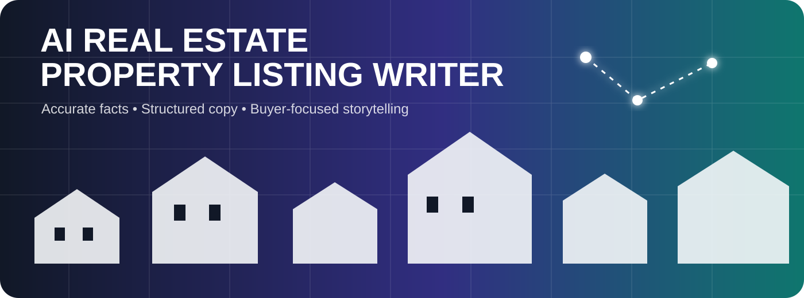
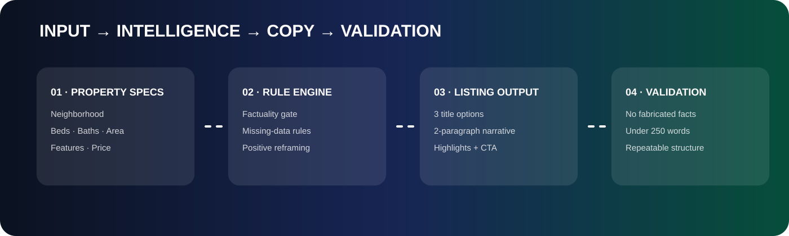
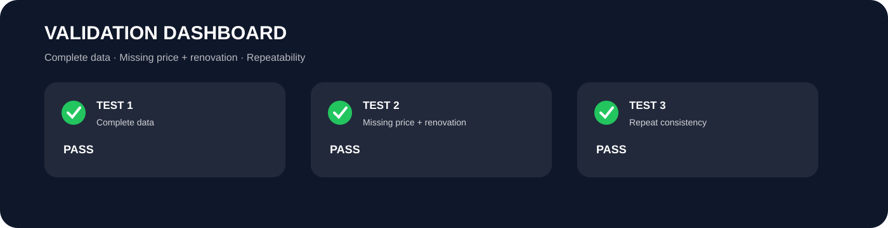

# 🏡 AI Real Estate Property Listing Writer

<div align="center">



### Turn raw property specifications into accurate, buyer-focused listing copy.

[](#-validation-dashboard) [](https://chatgpt.com/)

</div>

---

## ✨ What this project does

**Property Listing Writer Workspace** converts raw property specs into four polished listing components:

**3 title options → 2-paragraph narrative → quick highlights → viewing CTA**

The workflow is built around one principle: **persuasive copy without invented facts**.

<div align="center">

</div>

---

## 🚦 Quick Access

| Resource | Open |
|---|---|
| 🎥 Loom Demo | [Watch the end-to-end walkthrough](https://www.loom.com/share/14c78a6e67254497afd46c1a5994883c) |
| 🤖 ChatGPT Evidence | [Open shared evidence](https://chatgpt.com/share/6abb1ffe-4a3c-83e8-b91e-f83767c83c0b) |
| 📄 Submission PDF | [Open assessment report](Topic_9_AI_Real_Estate_Property_Listing_Writer_Submission.pdf) |
| 📚 Source Guidelines | [Open](01_Real_Estate_Listing_Copy_Guidelines.docx) |
| 🧩 Templates & Examples | [Open](02_Property_Listing_Templates_and_Examples.docx) |
| 🧪 Test Cases | [Open](03_Real_Estate_Test_Cases_and_Validation_Checklist.docx) |

---

## 🧠 Core Intelligence

- Factuality gate: never invent price, specs, features, or neighborhood details.
- Missing-data handling: missing price is omitted; missing specifications can use the project rule `Details upon request`.
- Renovation reframing: accurately position renovation as an opportunity to customize and add value.
- Buzzword control: avoid unsupported hype and clichés.
- Structured generation: preserve the required four-part output contract.
- Consistency: preserve core property facts across repeated runs.
- Scope control: no mortgage estimates or property-tax commentary.

---

## 📊 Validation Dashboard

<div align="center">

</div>

| Test | Scenario | Result |
|---|---|---|
| ✅ Test 1 | Complete data — Greenwood, 3 bed, 2 bath, large deck, $400k | **PASS** |
| ✅ Test 2 | Missing price + renovation needed | **PASS** |
| ✅ Test 3 | Repeated input consistency | **PASS** |

### Test 1 — Complete Data

```text
Neighborhood: Greenwood
Property Type: Single-family
Bedrooms: 3
Bathrooms: 2
Features: Large deck
Price: $400k
```

### Test 2 — Missing Price + Renovation

```text
Neighborhood: Greenwood
Property Type: Single-family
Bedrooms: 3
Bathrooms: 2
Square Footage: 1,850 sq ft
Features: Large deck
Condition: Needs renovation
```

### Test 3 — Repeatability

The complete-data scenario was run again. Core facts and the four-part structure remained consistent while wording varied naturally.

---

## 🧩 Project Output Contract

**01 — TITLE OPTIONS**  
Exactly 3 short headlines.

**02 — NARRATIVE**  
Exactly 2 paragraphs, under 250 words, lifestyle-focused and fact-grounded.

**03 — QUICK HIGHLIGHTS**  
Concise bullets covering available property information.

**04 — CTA**  
One closing sentence encouraging a viewing or tour.

---

## 🎥 Demo

The Loom walkthrough demonstrates project setup, source configuration, instructions, complete-data generation, missing-price/renovation handling, and repeatability validation.

**[▶ Watch Loom Demo](https://www.loom.com/share/14c78a6e67254497afd46c1a5994883c)**

---

## 👤 Author

**Shaik Mohammad Shaheed**  
AI & Automation • n8n • API Integration • Webhooks • AI Agents • Generative AI

---

<div align="center">
**Built as a practical AI copywriting workflow showcase.**
</div>